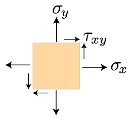

Tensors are common objects in engineering, physics, and differential geometry.
In mechanics of materials the stress acting on any point within the material is represented as a tensor and in general relativity the metric tensor is the central object.

So what is a tensor, exactly?
In this post we will discuss the motivation for them, looking first at vectors (aka _rank-1 tensors_) and then generalizing to higher rank tensors by looking at the stress tensor.
This will primarily be a _physcially based_ introduction to the topic.
In future posts we will look at covariant and contravariant tensors as well as the metric tensor from a more mathematically pure point of view.

## Vectors
For many of us our first experience with vectors came from an introductory physics class, where we learned that a _vector_ is both a direction and a magnitude.
It can be used to represent the velocity that an object has, as well as magnetic and gravitational fields at a point.
As an example, if an object has velocity $v = (3, 4)$, then it is moving with the speed $||v|| = \sqrt{3^2 + 4^2} = 5$ in the direction $(3/5, 4/5)$ from the origin.

What you may not remember, however, is that $(3, 4)$ is _not a vector_.
It is merely the _representation_ of the vector with respect to a certain choice of basis, which is generally assumed to be the standard basis $e_1 = (1, 0)$, $e_2 = (0, 1)$.
However, we could have chosen any other basis for $\mathbb{R}^2$ that we wanted to.

For example, in the basis $e_1 = (3, 0)$, $e_2 = (0, 4)$, our vector is now represented as $v = (1, 1)$.
The _representation_ has changed, but _the vector is the same_.
This is important because if two people both look at the same moving object, it should have the same velocity, regardless of which direction they are looking at it from.
In other words, it behaves predictibly under coordinate transformations, and equipped with knowledge of the basis you can sensibly speak of the vector itself.

## Higher Rank Tensors

For a vector, we needed one "row" of data, or one "array" of numbers.
This was sufficient to express all of the relevant information about direction and magnitude.
Is this enough information to express other types of data?

Let's look at stress in 2d to see if this is the case.
The stresses present at a point can be visualized like this:

 

As we see, there are 3 different stresses to represent, $\sigma_y$ is the stress in the $y$ direction, $\sigma_x$ is the stress in the $x$ direction, and $\tau_{xy}=\tau_{yx}$ are the shear stresses, each of which is acting on its respective plane.
(We have $\tau_{xy}=\tau_{yx}$ because we assume our material is in equilibrium, i.e. not rotating.)

Each of these stresses is itself a vector, so we need some object that can store vectors in it, a single vector is no longer enough.
Since it should represent a physical property, it also shouldn't change based on how we look at it, i.e. our choice of basis.
It should act similarly to a vector in that its representation changes predictibly under a change of basis.
What if we stored it as a "vector of vectors"?

$$ 
\sigma = 
\begin{bmatrix}
    \sigma_{x} & \tau_{xy} \\
    \tau_{yx} & \sigma_{y} \\
\end{bmatrix}
$$

This is called the _stress tensor_ and it is a rank-2 tensor.
Under change of coordinate basis its representation will change just like a vector will and the underlying physical properties will remain the same.

But isn't this just a standard matrix?
Why do we need the formality of tensors?
There are two reasons that come to mind:

1. Tensors are defined for arbitrary rank.
Take, for example, the compliance tensor.
If $\sigma$ is the rank 2 stress tensor and $\epsilon$ is the rank 2 strain tensor, then the generalized Hooke's law gives us the constitutive equation 

   $$ \sigma = C : \epsilon$$ 

   Where $C$ is the rank 4 compliance, or elasticity, tensor and "$:$" is tensor contraction.
   A rank-4 tensor will have 4 indices, $C_{ijkl}$, just like a rank-1 tensor, i.e. vector, has one index $v_i$ and a rank-2 tensor has 2 indices $\sigma_{ij}$.
We need more than simply a matrix to describe the behavior of an elastic material, so generalizing to higher rank tensors is well-motivated.

2. A matrix corresponds to a linear map $T : V \rightarrow W$ where $V$ and $W$ are vector spaces.
Tensors allow us to generalize to maps between the _dual spaces_ $V^\*$ and $W^\*$, whereas a standard matrix does not.
We will discuss this more in the next post on covariant and contravariant tensors.

